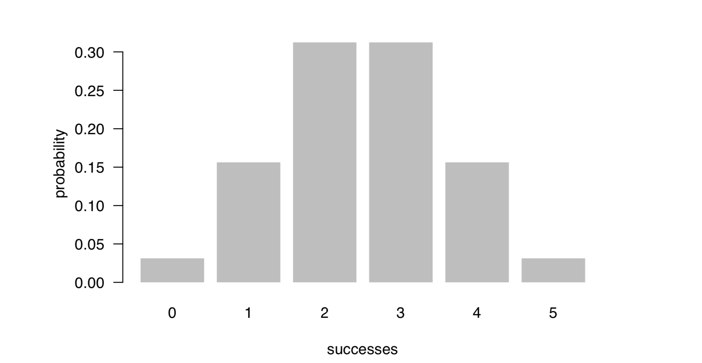
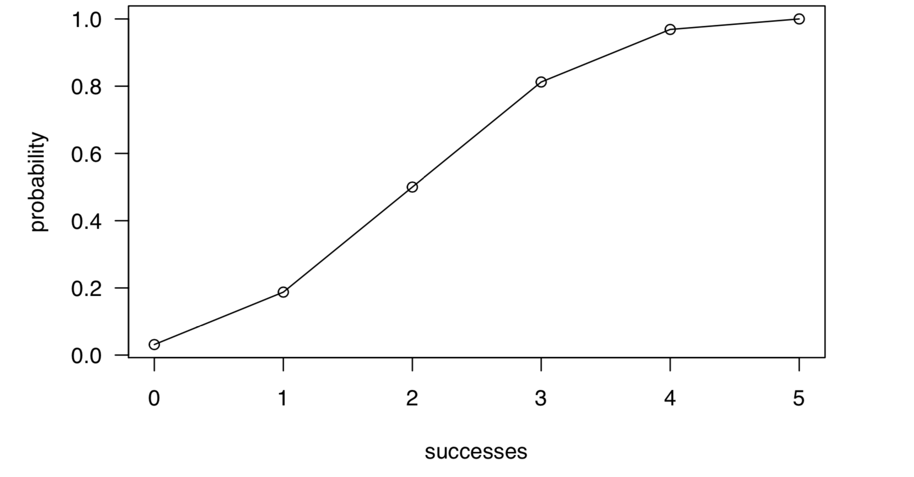

Overview
--------

The package `"binomial"` is an implementation for simulating probabilities about the number of successes in a fixed number of random trials performed under identical conditions, and to summarize the statistic of the binomial distribution. Also, providing a visualiztion the relative probability in the binomial distribution.

main functions and methods:

– `bin_choose()` calculates the number of
combinations in the number of `k` successes among the `n` trial.

– `bin_probability()`calculates the probability that `k` successes with `p` probability can occur in the `n` trials.

– `bin_distribution()`creates a data frame to list a binomial probability distribution.

– `bin_cumulative()`creates a data frame to list a binomial probability and cumulative probability distribution.

– `bin_variable()`calculates a binomial random variable object.

– `bin_mean()` calculates the mean of a binomail distribution.

– `bin_variance()` calculates the varince of a binomail distribution.

– `bin_mode()` calculates the mode of a binomail distribution.

– `bin_skewness()` calculates the skewness of a binomail distribution.

– `bin_kurtosis()`calculates the kurtosis of a binomail distribution.

Installation
--------

Install the development version from GitHub via the package
`"devtools"`:

``` r
# development version from GitHub:
#install.packages("devtools") 

# install "binomial" (without vignettes)
devtools::install_github("stat133-sp19/hw-stat133-lynn0707/binomial")

# install "cointoss" (with vignettes)
devtools::install_github("stat133-sp19/hw-stat133-lynn0707/binomial", build_vignettes = TRUE)
```

Usage
-----

``` r
library(binomial)

# getting combinations of 2 successes in 5 trials
bin_choose(n = 5, k = 2) 
#> [1] 10

# probability of getting 2 successes in 5 trials
# (assuming prob of success = 0.5) 
bin_probability(k = 2, n = 5, p = 0.5)
#> [1] 0.3125

# binomial probability distribution
bin_distribution(n = 5, prob = 0.5)
#>   success probability
#> 1       0     0.03125
#> 2       1     0.15625
#> 3       2     0.31250
#> 4       3     0.31250
#> 5       4     0.15625
#> 6       5     0.03125

# plotting binomial probability distribution
dis1 <- bin_distribution(n = 5, p = 0.5) 
plot(dis1)
```



```r
# binomial cumulative distribution
bin_cumulative(n = 5, p = 0.5)

#>   success probability cumulative
#> 1       0     0.03125    0.03125
#> 2       1     0.15625    0.18750
#> 3       2     0.31250    0.50000
#> 4       3     0.31250    0.81250
#> 5       4     0.15625    0.96875
#> 6       5     0.03125    1.00000

# plotting binomial cumulative distribution
dis2 <- bin_cumulative(n = 5, p = 0.5) 
plot(dis2)
```



```r
# binomial random variable object
bin1 <- bin_variable(n = 10, p = 0.3) 
bin1
#> "Binomial variable"
#> 
#> Paramaters
#> - number of trials:  10 
#> - prob of success:  0.3

# summary of a binomial variable
binsum1 <- summary(bin1)
binsum1
#> "Summary Binomial"
#> 
#> Paramaters
#> - number of trials:  10 
#> - prob of success:  0.3 
#> 
#> Measures
#> - mean    :  3 
#> - variance:  2.1 
#> - mode    :  0.2760262 
#> - kurtosis:  -0.1238095
```

Functions of measures
--------
These functions contains the statistics of the binomial distrbution as mean, variance, mode, skewness, kurtosis.

```{r}
bin_mean(10, 0.3)
#> [1] 3
bin_variance(10, 0.3)
#> [1] 2.1
bin_mode(10, 0.3)
#> [1] 3
bin_skewness(10, 0.3)
#> [1] 0.2760262
bin_kurtosis(10, 0.3)
#> [1] -0.1238095

```

