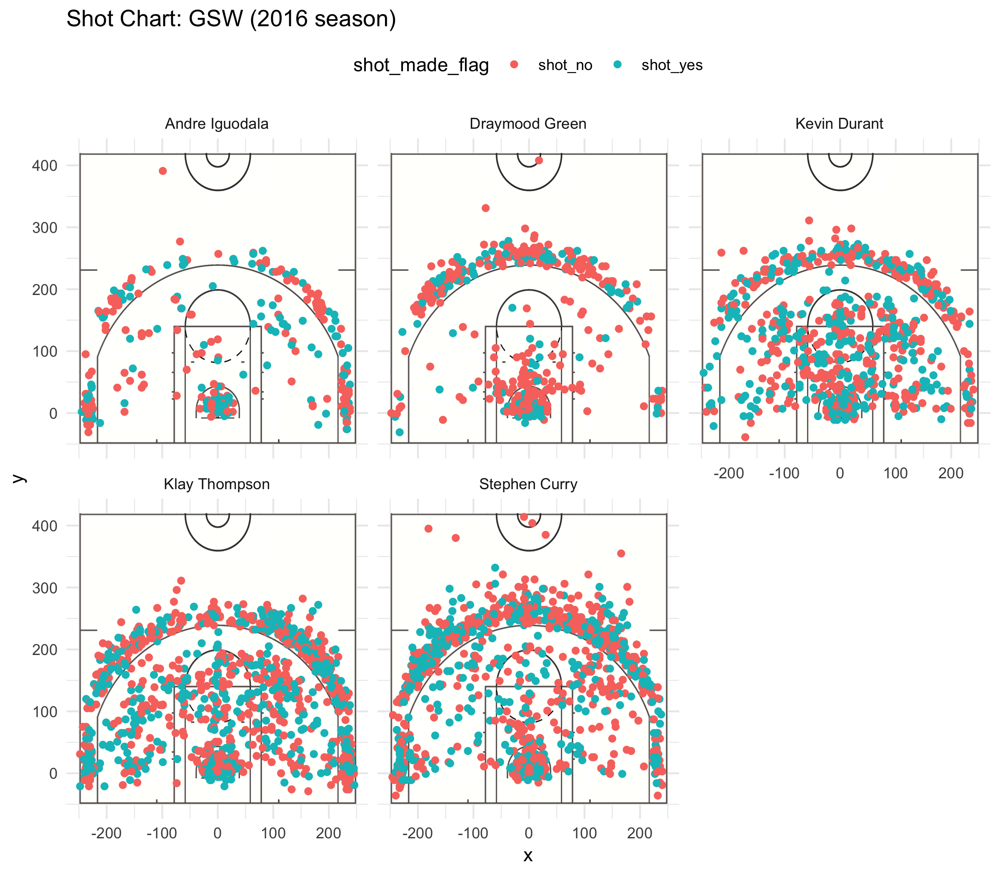

Workout01-ting-ling
================
ting ling
3/10/2019

Introduction
------------

In the 2016-2017 season, the Golden State Warriors won their fifth NBA Championship, and they created the best postseason record in the NBA history. \[1\] The main players in this season were Stephen Curry, Klay Thompson, Draymond Green, Kevin Durant, and Andre Iguodala, and it Due to the excellent performance, the Warriors were given as a “Superteam” by the media and fans. Also, a new All-Star “Fantastic Four” was formed by Stephen Curry, Klay Thompson, Draymond Green, and Kevin Durant.\[2\] Hence, the Warriors took many rewards in this season. For example, Draymond Green won the Defensive Player of the Year Award at the NBA Awards. Kevin Durant won the NBA Finals MVP award. The Warriors won the Team of the Year Award at the Espy Awards.\[3\]

Purpose
-------

Based on the summaries of the two-points, three-points, and overall effective shooting percentage by these five main players, the reasons why the Warriors could gain such a big success can be explored.

Alanysis
--------

The effective shooting percentage is determined by the number of successd shooting dividing by the number of the total shooting during this season. According to Table 1, the percetages of successful shooting for all the players are over 0.50. Andre contributed the most highest rate, but his total number of shooting was the lowest one. As a defender, He was not a scorer on this team, which could explain why his total number of shooting was very low. However, he still contributed the most he would for the victory of the games, even though the data cannot show the ablility of defending the opponents.

Table 1: 2PT Effective Shooting % by Player

``` r
shot_data <- read.csv(file = "../data/shot-data.csv")
twopt <- filter(shot_data, shot_type =="2PT Field Goal" )
twopt <- dplyr::summarise(group_by(twopt, name),
          total = sum(shot_type == "2PT Field Goal"),
          made = sum(shot_made_flag == "shot_yes"),
          perc_made = made/total)
twopt <- arrange(twopt, desc(perc_made))
knitr::kable(twopt)
```

| name           |  total|  made|  perc\_made|
|:---------------|------:|-----:|-----------:|
| Andre Iguodala |    210|   134|   0.6380952|
| Kevin Durant   |    643|   390|   0.6065319|
| Stephen Curry  |    563|   304|   0.5399645|
| Klay Thompson  |    640|   329|   0.5140625|
| Draymood Green |    346|   171|   0.4942197|

Klay Thompson and Stephen Curry are famous three-points shooters. As Table 2 shown, their percetage of three-points effective shooting was over 0.40, which meant that they could gain 120 points per 100 shooting.

Table 2: 3PT Effective Shooting % by Player

``` r
threept <- filter(shot_data,shot_type == "3PT Field Goal" )
threept <- dplyr::summarise(group_by(threept, name),
          total = sum(shot_type == "3PT Field Goal"),
          made = sum(shot_made_flag == "shot_yes"),
          perc_made = made/total)
threept <- arrange(threept, desc(perc_made))
knitr::kable(threept)
```

| name           |  total|  made|  perc\_made|
|:---------------|------:|-----:|-----------:|
| Klay Thompson  |    580|   246|   0.4241379|
| Stephen Curry  |    687|   280|   0.4075691|
| Kevin Durant   |    272|   105|   0.3860294|
| Andre Iguodala |    161|    58|   0.3602484|
| Draymood Green |    232|    74|   0.3189655|

Depending on Table 3, it is no doubt that Kevin Durant won the NBA Finals MVP award since his percentage of total effecitve shooting was 0.54, which was the highest in his team.
Table 3: Overall Effective Shooting % by Player

``` r
overallpt <- dplyr::summarise(group_by(shot_data, name),
          total = sum(shot_type == "3PT Field Goal" |              
                        shot_type ==  "2PT Field Goal" ),
          made = sum(shot_made_flag == "shot_yes"),
          perc_made = made/total)
overallpt <- arrange(overallpt, desc(perc_made))
knitr::kable(overallpt)  
```

| name           |  total|  made|  perc\_made|
|:---------------|------:|-----:|-----------:|
| Kevin Durant   |    915|   495|   0.5409836|
| Andre Iguodala |    371|   192|   0.5175202|
| Klay Thompson  |   1220|   575|   0.4713115|
| Stephen Curry  |   1250|   584|   0.4672000|
| Draymood Green |    578|   245|   0.4238754|

From Figure 1, the distance to shoot the 3-point from Stephen Curry and Klay Thompson was more far away than other players. Also, the total number of the shooting was almost twice as the defenders Andre Iguodala and Draymood Green. When looking at the picture, it was very amazing to notice that Curry could get points at a very long distance, so he shooted like a magician from the three-point line.

Figure 1: The Shoot Chart of the Golden State Warriors 

Conclusion
----------

To sum up, the Golden State Warriors was formed the elite players in 2016 season, who were Stephen Curry, Klay Thompson, Draymond Green, Kevin Durant, and Andre Iguodala. According to analyzing their effective shooting, the conclusion was that each player perform their best ability during the season.

Refernce:
---------

1.  "Purdy: Put a pause on the dynasty talk–and just enjoy this Warriors title". Mercury News. Retrieved June 12, 2017
2.  "Durant's move to Warriors brings NBA 'Superteam' talk". Yahoo News. July 5, 2016.
3.  "NBA finals: Golden State Warriors win title against Cavaliers – as it happened". Guardian. June 13, 2017. Retrieved June 14, 2017.
